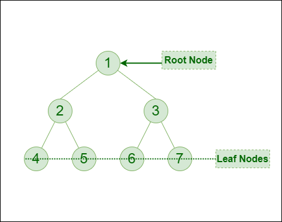

# Introduction to Binary Tree – Data Structure and Algorithm Tutorials

A tree is a popular data structure that is non-linear in nature. Unlike other data structures like an array, stack, queue, and linked list which are linear in nature, a tree represents a hierarchical structure. The ordering information of a tree is not important. A tree contains nodes and 2 pointers. These two pointers are the left child and the right child of the parent node. Let us understand the terms of tree in detail.

- Root: The root of a tree is the topmost node of the tree that has no parent node. There is only one root node in every tree.

- Parent Node:  The node which is a predecessor of a node is called the parent node of that node.

- Child Node: The node which is the immediate successor of a node is called the child node of that node.

- Sibling: Children of the same parent node are called siblings.

- Edge: Edge acts as a link between the parent node and the child node.

- Leaf: A node that has no child is known as the leaf node. It is the last node of the tree. There can be multiple leaf nodes in a tree.

- Subtree: The subtree of a node is the tree considering that particular node as the root node.

- Depth: The depth of the node is the distance from the root node to that particular node.

- Height: The height of the node is the distance from that node to the deepest node of that subtree.

- Height of tree: The Height of the tree is the maximum height of any node. This is the same as the height of the root node.

- Level: A level is the number of parent nodes corresponding to a given node of the tree.

- Degree of node:  The degree of a node is the number of its children.

- NULL: The number of NULL nodes in a binary tree is (N+1), where N is the number of nodes in a binary tree.

## Why to use Tree Data Structure? 

1. One reason to use trees might be because you want to store information that naturally forms a hierarchy. For example, the file system on a computer: 

2. Trees (with some ordering e.g., BST) provide moderate access/search (quicker than Linked List and slower than arrays). 

3. Trees provide moderate insertion/deletion (quicker than Arrays and slower than Unordered Linked Lists). 

4. Like Linked Lists and unlike Arrays, Trees don’t have an upper limit on the number of nodes as nodes are linked using pointers.

## The main applications of tree data structure: 

1. Manipulate hierarchical data. 

2. Make information easy to search (see tree traversal). 

3. Manipulate sorted lists of data. 

4. As a workflow for compositing digital images for visual effects. 

5. Router algorithms 

6. Form of multi-stage decision-making (see business chess). 

## Binary Tree Representation

A binary tree is a tree data structure composed of nodes, each of which has at most, two children, referred to as left and right nodes and the tree begins from root node.

A Binary tree is represented by a pointer to the topmost node (commonly known as the “root”) of the tree. If the tree is empty, then the value of the root is NULL. Each node of a Binary Tree contains the following parts:

1. Data

2. Pointer to left child

3. Pointer to right child

## Basic Operation On Binary Tree:

- Inserting an element.

- Removing an element.

- Searching for an element.

- Traversing the tree.

## Auxiliary Operation On Binary Tree:

- Finding the height of the tree

- Find the level of a node of the tree

- Finding the size of the entire tree.

## Applications of Binary Tree:

- In compilers, Expression Trees are used which is an application of binary trees.

- Huffman coding trees are used in data compression algorithms.

- Priority Queue is another application of binary tree that is used for searching maximum or minimum in O(1) time complexity.

- Represent hierarchical data.

- used in editing software like Microsoft Excel and spreadsheets.

- useful for indexing segmented at the database is useful in storing cache in the system,

- syntax trees are used for most famous compilers for programming like GCC, and AOCL to perform arithmetic operations.

- for implementing priority queues.

- used to find elements in less time (binary search tree)

- used to enable fast memory allocation in computers. 

- to perform encoding and decoding operations.

## Binary Tree Traversals:

Tree Traversal algorithms can be classified broadly into two categories:

- Depth-First Search (DFS) Algorithms

- Breadth-First Search (BFS) Algorithms

## Tree Traversal using Depth-First Search (DFS) algorithm can be further classified into three categories:

- Preorder Traversal (current-left-right: Visit the current node before visiting any nodes inside the left or right subtrees. Here, the traversal is root – left child – right child. It means that the root node is traversed first then its left child and finally the right child.

- Inorder Traversal (left-current-right): Visit the current node after visiting all nodes inside the left subtree but before visiting any node within the right subtree. Here, the traversal is left child – root – right child.  It means that the left child is traversed first then its root node and finally the right child.

- Postorder Traversal (left-right-current): Visit the current node after visiting all the nodes of the left and right subtrees.  Here, the traversal is left child – right child – root.  It means that the left child has traversed first then the right child and finally its root node.

## Tree Traversal using Breadth-First Search (BFS) algorithm can be further classified into one category:

- Level Order Traversal:  Visit nodes level-by-level and left-to-right fashion at the same level. Here, the traversal is level-wise. It means that the most left child has traversed first and then the other children of the same level from left to right have traversed. 

Pre-order Traversal of the above tree: 1-2-4-5-3-6-7
In-order Traversal of the above tree: 4-2-5-1-6-3-7
Post-order Traversal of the above tree: 4-5-2-6-7-3-1
Level-order Traversal of the above tree: 1-2-3-4-5-6-7

## Implementation of Binary Tree:

Let us create a simple tree with 4 nodes. The created tree would be as follows. 

Summary: Tree is a hierarchical data structure. Main uses of trees include maintaining hierarchical data, providing moderate access and insert/delete operations. Binary trees are special cases of tree where every node has at most two children.

