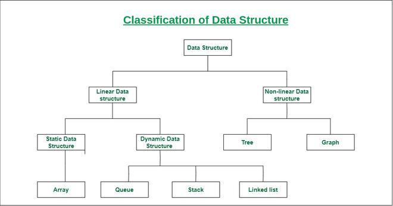

## Snapped code for Data Structure and Algorithms Analysis - Job Interview  PlayList in Udemy, Enroll using a [ 95% discount coupon](https://www.udemy.com/course/data-structure-and-algorithms-analysis/?referralCode=D1C3669A1F5ACB502F67). 

 ## Course Description

In this course you will learn how to Analysis algorithms like Sorting, Searching,  and Graph algorithms. And how to reduce the code complexity from one Big-O  level to another level. Furthermore, you will learn different type of Data Structure for your code. Also you will learn how to find Big-O for every data structure, and how to apply  correct Data Structure to your problem in Java. By the end you will be able to write code that run faster and use low memory. You Also will learn  how to analysis problems using Dynamic programming. 

We will discus code complexity in Different algorithms like Sorting algorithms ( Bubble, Merge, Heap, and quick sort) , searching algorithms ( Binary search, linear search, and Interpolation), Graph algorithms( Binary tree, DFS, BFS, Nearest Neighbor and Shortest path, Dijkstra's Algorithm, and A* Algorithm). and Data Structure like Dynamic Array, Linked List, Stack, Queue, and Hash-Table

## Classification of Data Structure: 

- <h2>Linear data structure:</h2> Data structure in which data elements are arranged sequentially or linearly, where each element is attached to its previous and next adjacent elements, is called a linear data structure. Examples of linear data structures are array, stack, queue, linked list, etc.

  - <h3>Static data structure:</h3> Static data structure has a fixed memory size. It is easier to access the elements in a static data structure. An example of this data structure is an array.

  - <h3>Dynamic data structure:</h3> In dynamic data structure, the size is not fixed. It can be randomly updated during the runtime which may be considered efficient concerning the memory (space) complexity of the code. Examples of this data structure are queue, stack, etc.

- <h2>Non-linear data structure:</h2> Data structures where data elements are not placed sequentially or linearly are called non-linear data structures. In a non-linear data structure, we can’t traverse all the elements in a single run only. Examples of non-linear data structures are trees and graphs.

